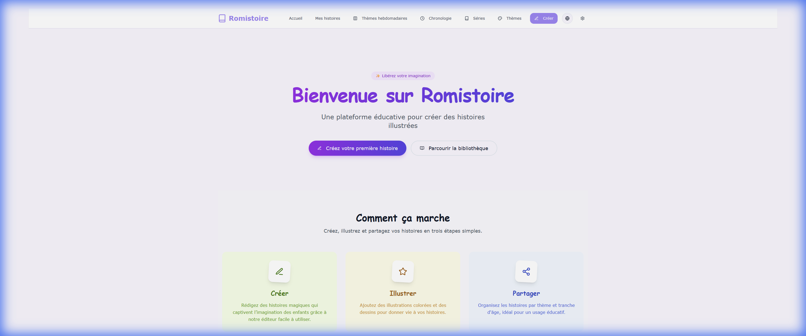
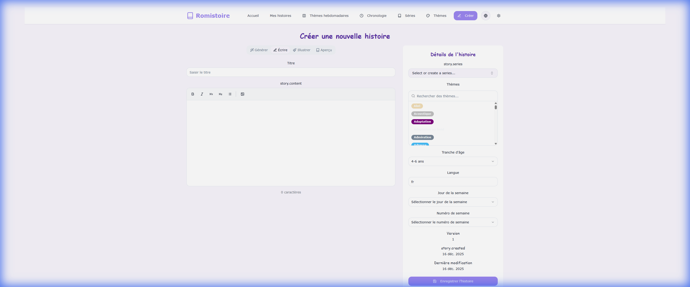
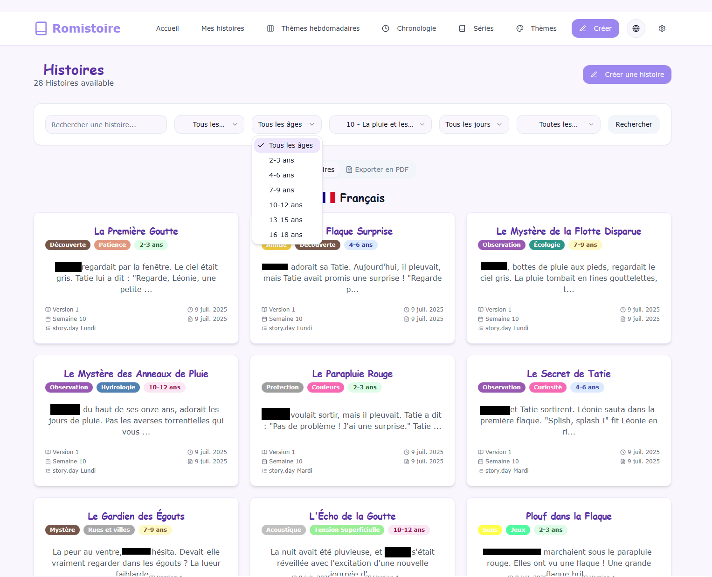

# 📚 Romistoire

 

**[English]**  
Romistoire is an interactive educational platform designed to help children and educators create, illustrate, and manage magical stories. Powered by AI (Google Gemini), it allows users to generate text and illustration prompts, organize content by themes and age groups, and export stories as beautifully formatted PDFs.

**[Français]**  
Romistoire est une plateforme éducative interactive conçue pour aider les enfants et les éducateurs à créer, illustrer et gérer des histoires magiques. Propulsée par l'IA (Google Gemini), elle permet de générer des textes et des prompts pour illustrations, d'organiser le contenu par thèmes et tranches d'âge, et d'exporter les histoires sous forme de PDF magnifiquement formatés.

---

## ✨ Features / Fonctionnalités

### 🇬🇧 English
- **📖 AI Story Generation**: Generate creative stories based on themes, age groups, and characters using Google Gemini.
- **🎧 AI Audio Narrations**: Turn stories into audio using advanced Text-to-Speech (Google Gemini).
- **🎨 AI Illustration Prompts**: Generate detailed prompts for illustrations to guide your creative process.
- **📂 Theme Management**: Organize stories into customizable weekly themes.
- **🖨️ PDF Export**: Export single stories or entire collections (Theme Books) to PDF with cover pages and table of contents.
- **⚙️ Advanced Settings**: Manage data, logs (System & Network), and developer modes with dynamic logging configuration.
- **🌍 Bilingual**: Fully localized in English and French.

### 🇫🇷 Français
- **📖 Génération d'Histoires par IA** : Générez des histoires créatives basées sur des thèmes, tranches d'âge et personnages via Google Gemini.
- **🎧 Narrations Audio par IA** : Transformez les histoires en audio grâce à la synthèse vocale avancée (Google Gemini).
- **🎨 Prompts d'Illustration par IA** : Générez des descriptions détaillées pour guider la création de vos illustrations.
- **📂 Gestion des Thèmes** : Organisez les histoires dans des thèmes hebdomadaires personnalisables.
- **🖨️ Export PDF** : Exportez des histoires individuelles ou des collections entières (Livres Thématiques) en PDF avec couvertures et table des matières.
- **⚙️ Paramètres Avancés** : Gérez les données, les journaux (Système & Réseau) et configurez les logs dynamiquement sans redémarrage.
- **🌍 Bilingue** : Entièrement traduit en Anglais et Français.

## 📸 Screenshots / Captures d'écran

<div align="center">
  
  <p><i>Home Page / Page d'Accueil</i></p>
  
  
  <p><i>Create Story / Créer une Histoire</i></p>

  
  <p><i>Library / Bibliothèque</i></p>
</div>

---

## 🛠️ Tech Stack / Stack Technique

- **Frontend**: React 18, Vite, TypeScript, React Query
- **UI Architecture**: TailwindCSS, Radix UI, Lucide React, Shadcn/ui
- **Backend**: Node.js, Express
- **Database**: MySQL (via `mysql2`)
- **AI Integration**: Google Gemini API, Ollama (Local)
- **Utilities**: `jspdf` (PDF), `winston` (Logging), `i18next` (Internationalization)

---

## 🚀 Getting Started / Démarrage

### Prerequisites / Prérequis
- **Node.js** (v18+)
- **MySQL** database server

### Installation

1. **Clone the repository / Cloner le dépôt**
   ```bash
   git clone https://github.com/your-username/romistoire.git
   cd romistoire
   ```

2. **Install dependencies / Installer les dépendances**
   ```bash
   npm install
   ```

3. **Database Setup / Configuration Base de Données**
   - Create a MySQL database (e.g., `imagitales`).
   - Run the initialization script:
     ```bash
     mysql -u root -p imagitales < scripts/init-db.sql
     ```

4. **Environment Configuration / Configuration Environnement**
   Create a `.env` file in the root directory:
   ```env
   # Database
   DB_HOST=localhost
   DB_USER=root
   DB_PASSWORD=your_password
   DB_NAME=imagitales

   # Server
   PORT=3000
   VITE_API_URL=http://localhost:3000

   # AI Keys
   GEMINI_API_KEY=your_gemini_api_key
   ```

5. **Run Application / Lancer l'Application**
   ```bash
   npm run dev
   ```
   This command starts both the backend API and the Vite frontend concurrently.
   *Cette commande lance simultanément l'API backend et le frontend Vite.*

---

## 📜 Scripts

| Command | Description |
|Col |---|
| `npm run dev` | Start both backend and frontend in dev mode |
| `npm run dev:api` | Start only backend with watch mode |
| `npm run dev:vite` | Start only frontend |
| `npm run build` | Build frontend for production |
| `npm run typecheck` | Run TypeScript type checking |
| `npm test` | Run Vitest tests |

---

## 🤝 Contributing / Contribuer

**[English]**  
Contributions are welcome! See [CONTRIBUTING.md](./CONTRIBUTING.md) for details on how to report bugs, suggest features, or submit pull requests.

**[Français]**  
Les contributions sont les bienvenues ! Consultez [CONTRIBUTING.md](./CONTRIBUTING.md) pour savoir comment signaler des bugs, suggérer des fonctionnalités ou soumettre des pull requests.


---

## 📄 License / Licence

**[English]**  
Distributed under the **CC BY-NC-SA 4.0** License. This means you are free to share and adapt the work, provided you give appropriate credit, do not use it for commercial purposes, and distribute your contributions under the same license. See `LICENSE` for more information.

**[Français]**  
Distribué sous la licence **CC BY-NC-SA 4.0**. Cela signifie que vous êtes libre de partager et d'adapter l'œuvre, à condition de créditer l'auteur, de ne pas l'utiliser à des fins commerciales, et de distribuer vos contributions sous la même licence. Voir `LICENSE` pour plus d'informations.
