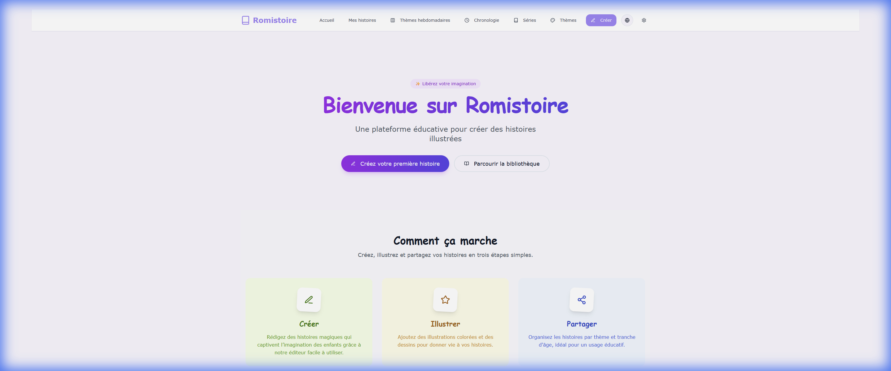
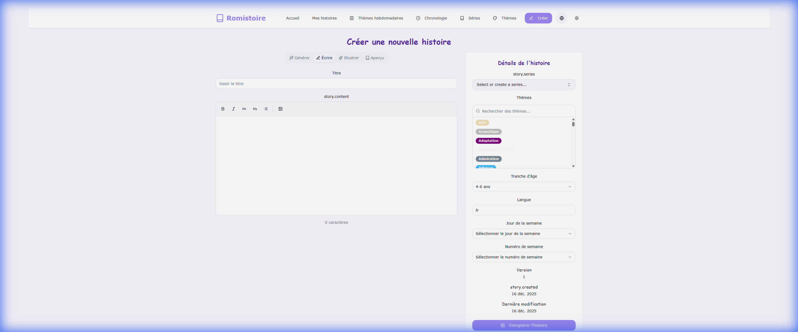
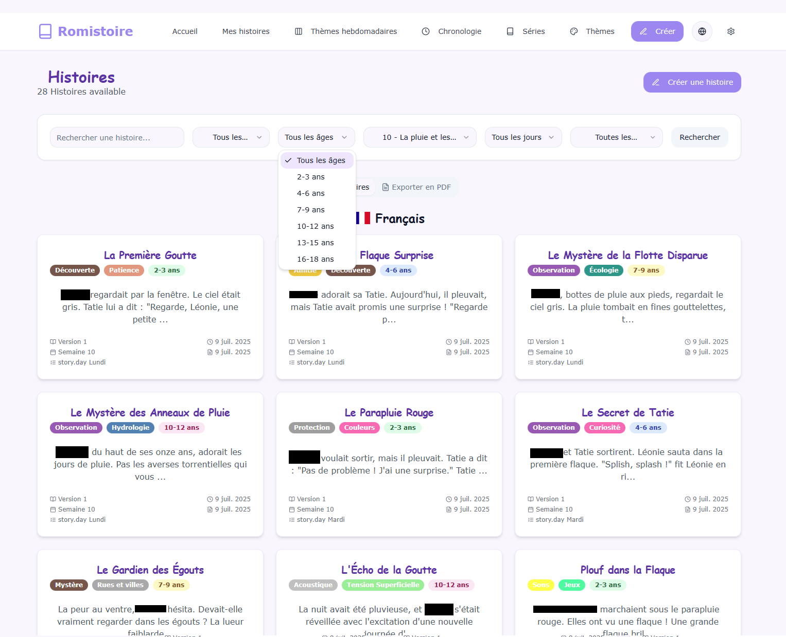

# 📚 imagitales

 

**[English]**  
imagitales is an interactive educational platform designed to help children and educators create, illustrate, and manage magical stories. Powered by AI (Google Gemini), it allows users to generate text and illustration prompts, organize content by themes and age groups, and export stories as beautifully formatted PDFs.

**[Français]**  
imagitales est une plateforme éducative interactive conçue pour aider les enfants et les éducateurs à créer, illustrer et gérer des histoires magiques. Propulsée par l'IA (Google Gemini), elle permet de générer des textes et des prompts pour illustrations, d'organiser le contenu par thèmes et tranches d'âge, et d'exporter les histoires sous forme de PDF magnifiquement formatés.

---

## ✨ Features / Fonctionnalités

### 🇬🇧 English
- **📖 AI Story Generation**: Generate creative stories based on themes, age groups, and characters using Google Gemini.
- **🎧 AI Audio Narrations**: Turn stories into audio using advanced Text-to-Speech (Google Gemini).
- **🎨 AI Illustration Prompts**: Each generated story comes with a detailed illustration prompt (shown with a copy button until an illustration is added).
- **🗂️ Series & Versions**: Group stories into series, keep every saved version and restore any of them.
- **📂 Theme Management**: Organize stories into customizable weekly themes.
- **🖨️ PDF Export**: Export single stories or entire collections (Theme Books) to PDF with cover pages and table of contents.
- **⚙️ Advanced Settings**: Manage data, logs (System & Network), and developer modes with dynamic logging configuration.
- **🌍 Bilingual**: Fully localized in English and French.

### 🇫🇷 Français
- **📖 Génération d'Histoires par IA** : Générez des histoires créatives basées sur des thèmes, tranches d'âge et personnages via Google Gemini.
- **🎧 Narrations Audio par IA** : Transformez les histoires en audio grâce à la synthèse vocale avancée (Google Gemini).
- **🎨 Prompts d'Illustration par IA** : Chaque histoire générée est accompagnée d'une description détaillée de l'illustration (affichée avec un bouton « Copier » tant qu'aucune image n'est ajoutée).
- **🗂️ Séries & Versions** : Regroupez les histoires en séries, conservez chaque version enregistrée et restaurez-la à tout moment.
- **📂 Gestion des Thèmes** : Organisez les histoires dans des thèmes hebdomadaires personnalisables.
- **🖨️ Export PDF** : Exportez des histoires individuelles ou des collections entières (Livres Thématiques) en PDF avec couvertures et table des matières.
- **⚙️ Paramètres Avancés** : Gérez les données, les journaux (Système & Réseau) et configurez les logs dynamiquement sans redémarrage.
- **🌍 Bilingue** : Entièrement traduit en Anglais et Français.

## 📸 Screenshots / Captures d'écran

<div align="center">
  
  <p><i>Home Page / Page d'Accueil</i></p>
  
  
  <p><i>Create Story / Créer une Histoire</i></p>

  
  <p><i>Library / Bibliothèque</i></p>
</div>

---

## 🛠️ Tech Stack / Stack Technique

- **Frontend**: React 18, Vite, TypeScript, React Query
- **UI Architecture**: TailwindCSS, Radix UI, Lucide React, Shadcn/ui
- **Backend**: Node.js, Express
- **Database**: MySQL (via `mysql2`)
- **AI Integration**: Google Gemini API, Ollama (Local)
- **Utilities**: `jspdf` (PDF), `dompurify` (HTML sanitizing), custom JSON i18n (`src/locales`, `src/lib/i18n.js`)

---

## 🚀 Getting Started / Démarrage

### Prerequisites / Prérequis
- **Node.js** (v18+)
- **MySQL** database server

### Installation

1. **Clone the repository / Cloner le dépôt**
   ```bash
   git clone https://github.com/your-username/imagitales.git
   cd imagitales
   ```

2. **Install dependencies / Installer les dépendances**
   ```bash
   npm install
   ```

3. **Database Setup / Configuration Base de Données**
   - Create a MySQL database (e.g., `imagitales`).
   - Run the initialization script:
     ```bash
     mysql -u root -p imagitales < scripts/init-db.sql
     ```

4. **Environment Configuration / Configuration Environnement**
   Create a `.env` file in the root directory:
   ```env
   # Database
   DB_HOST=localhost
   DB_USER=root
   DB_PASSWORD=your_password
   DB_NAME=imagitales

   # Server (the Vite dev server proxies /api to this port)
   API_PORT=3001

   # AI (cloud)
   GEMINI_API_KEY=your_gemini_api_key
   # Optional: model fallback order, comma separated
   # Default: Flash Lite (500 req/day), then Flash (20 req/day each), then Gemma (slow, last resort)
   # Stories for 13-15 and 16-18 (900+ words) start with the Flash models: Flash Lite stops around 700 words
   # GEMINI_MODELS=gemini-3.5-flash-lite,gemini-3.8-flash,gemini-2.5-flash
   # GEMINI_AUDIO_MODELS=gemini-2.5-flash-preview-tts
   # GEMINI_TIMEOUT_MS=120000

   # AI (local, optional)
   # AI_PROVIDER=gemini            # default provider: gemini | local
   # OLLAMA_BASE_URL=http://localhost:11434
   # OLLAMA_MODEL=gemma4:e2b
   # OLLAMA_TIMEOUT_MS=600000
   ```

5. **Run Application / Lancer l'Application**
   ```bash
   npm run dev
   ```
   This command starts both the backend API and the Vite frontend concurrently.
   *Cette commande lance simultanément l'API backend et le frontend Vite.*

---

## 📜 Scripts

| Command | Description |
|---|---|
| `npm run dev` | Start both backend and frontend in dev mode |
| `npm run dev:api` | Start only backend with watch mode |
| `npm run dev:vite` | Start only frontend |
| `npm run build` | Build frontend for production |
| `npm start` | Start the backend (production) |
| `npm run preview` | Preview the production build |
| `npm run lint` | Run ESLint |
| `npm run typecheck` | Run TypeScript type checking |
| `npm test` | Run all tests (client + server) |
| `npm run test:client` | Run client tests (Vitest, jsdom) |
| `npm run test:server` | Run server tests (Vitest, node) |

---

## 🧠 How it works / Fonctionnement

### AI generation / Génération IA
- Stories are generated **in French**. The prompt lives in `server/services/helpers/prompt.helper.js`: a system instruction (role, child-safety and writing rules) plus a short structured prompt (theme, age profile, continuity, day rules, illustration).
- Models answer with **JSON** (`server/services/helpers/story_schema.js`): `{ "stories": [{ day, title, summary, themes, paragraphs, illustration_prompt }] }`.
  - Gemini models: `responseSchema` (constrained output) and `systemInstruction`.
  - Gemma models: the schema is described in the prompt (they do not support JSON mode).
  - Ollama: `format` = JSON schema (Ollama ≥ 0.5).
  - A full week for **2-3, 4-6 and 7-9** is generated in **one request** (short stories, 7 times fewer requests, 240 s timeout). From **10-12**, and always with Ollama, it is generated **day by day** (7 requests): the first day writes the week plan and the character sheets, each next day receives them with the days already told and the previous ending, which keeps the length asked for long stories.
  - Cloud requests start at least 12 s apart (free tier: 5 requests/min on Flash models). A story (or the median story of a week) under 60 % of its age's minimum length is asked once more.
  - If the answer is not valid JSON, the client falls back to the text parser (`src/utils/storyParser.ts`).
- Gemini errors: 400/401/403 stop immediately; 5xx get one more try then the next model; 429 waits the short delay suggested by the API, or moves on (daily quota: model skipped until the Pacific-time reset); 404/timeouts move to the next model. Failing models are skipped for a while (`server/services/helpers/model_cooldown.helper.js`), so a saturated model does not slow down every call.
- Gemini thinking is kept low for storytelling (`thinkingLevel: low` for Gemini 3.x, no thinking budget for 2.5).
- The AI log (`server/logs/ai-<date>.log`) records, for each answer, the model used, the models skipped and why, and a `Story-Parsed` entry with the word count of each story against the target of the age. Test runs do not write log files.

*Les histoires sont générées en français, au format JSON ; en cas de réponse non structurée, l'application lit le texte en mode de secours.*

### Series & aliases / Séries et alias
A slot is (week, day, age group, language, series). When a story is saved into a slot that is already taken **in the same series**, it is moved to an alias series named `<series> (Alias n)` and the user is warned.

*Un créneau déjà occupé dans la même série range l'histoire dans une série « Alias » ; l'utilisateur en est averti.*

### PDF export
- **Mes histoires → Exporter en PDF** builds a book on the server (jsPDF, `server/lib/pdf`): optional cover and table of contents, then each story (header with week, day, age and tags, main illustration, text, other illustrations), numbered pages.
- Three styles (`server/lib/pdf/themes.js`), chosen in the export options or **Automatic** (Kids when a story is for ages 2-6, Teen otherwise):
  - **Kids**: Andika reading font, large text, soft colors, rounded frames;
  - **Teen**: Poppins, navy and teal, "Day 1" markers;
  - **Pro**: Crimson Text, justified text with indents, running headers.
- Fonts are free fonts (SIL Open Font License) in `server/assets/fonts`, each with its `OFL.txt`.

### Illustrations workshop / Atelier d'illustrations
The image models of the Gemini API have no free quota, so images are made outside the app and attached back. Page **Illustrations** (`/illustrations`):
- lists the stories without image with a ready-to-paste prompt (style of the age group + `illustration_prompt` + "no text", `server/services/helpers/image_prompt.helper.js`);
- **Create the prompt**: Flash Lite writes the description of a story that has none (one short text call, saved without a new version);
- paste an image on a row (click then Ctrl+V), drop it, or pick a file;
- **Export** the prompts as `.txt` (by hand) or `.json` (Gemini Canvas tool);
- **Import** images or a ZIP: a file named with the story code (`IMG-7f3a2c91.png`) goes to its story, the others to the stories without image in download order;
- **Gemini Canvas tool** (`public/tools/canvas-illustrations.html`): pasted into Gemini Canvas, where the image models are available, it generates the images of the JSON export and downloads a ZIP named by code.

### Story tags vs. topic of the week
Two distinct notions:
- **Story themes (tags)** (`themes` table, page **Étiquettes** `/themes`): reusable labels, several per story.
  - Names are unique, ignoring case, accents, leading articles and plurals ("L'Océan" = "les océans").
  - Each story has exactly one **primary theme** (star in the editor), shown first everywhere.
  - The page offers search, sort, "to review" / "unused" filters, the stories of each tag (expand the card), duplicate merge, delete with reassignment and **bulk deletion of unused tags**.
  - AI generation reuses existing tags; a new AI tag is flagged "to review" until someone edits or merges it.
- **Topic of the week** (`weekly_themes` table, page **Programme** `/weekly-themes`): free text (topic + optional description) per ISO week (1-53), saved when the field loses focus. It guides story writing in the AI prompt; it is **not** a tag.
- Reusable UI lives in `src/components/Theme/` (`ThemeBadge`, `ThemeBadgeList`, `ThemeSelect`, `ThemeMultiSelect`, dialogs); rules live in `server/services/theme.service.js`.

*Les noms de thèmes sont uniques ; chaque histoire a un thème principal ; la page « Thèmes » regroupe la bibliothèque et le calendrier hebdomadaire.*

### Versions
Every save creates a version. Restoring a version first snapshots the current state, so a restore can always be undone; version numbers only go forward.

*Chaque enregistrement crée une version ; restaurer une version sauvegarde d'abord l'état courant.*

### Files / Fichiers
Images and audio live in `uploads/`. Files are deleted when nothing references them anymore; images uploaded on the create page and never saved are purged automatically after 24 h.

---

## 🤝 Contributing / Contribuer

**[English]**  
Contributions are welcome! See [CONTRIBUTING.md](./CONTRIBUTING.md) for details on how to report bugs, suggest features, or submit pull requests.

**[Français]**  
Les contributions sont les bienvenues ! Consultez [CONTRIBUTING.md](./CONTRIBUTING.md) pour savoir comment signaler des bugs, suggérer des fonctionnalités ou soumettre des pull requests.


---

## 📄 License / Licence

**[English]**  
Distributed under the **CC BY-NC-SA 4.0** License. This means you are free to share and adapt the work, provided you give appropriate credit, do not use it for commercial purposes, and distribute your contributions under the same license. See `LICENSE` for more information.

**[Français]**  
Distribué sous la licence **CC BY-NC-SA 4.0**. Cela signifie que vous êtes libre de partager et d'adapter l'œuvre, à condition de créditer l'auteur, de ne pas l'utiliser à des fins commerciales, et de distribuer vos contributions sous la même licence. Voir `LICENSE` pour plus d'informations.
